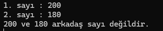
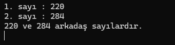
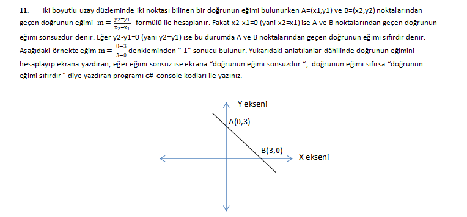
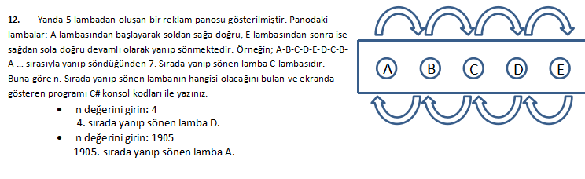

## 5. HAFTA ÇALIŞMA SORULARI

1. Klavyeden girilen sayının asal olup olmadığını bulan programı yazınız. NOT: Bir ve kendisinden başka böleni olmayan sayılara asal sayı denir. (Örnek 11, 13, 7….)

2. Klavyeden girilen iki sayının Ebob ve Ekok değerini bulan programı yazınız.

3. 6 kişi 4 sandalyeye 6*5*4*3=360 farklı şekilde, 10 kişi 3 sandalyeye 10*9*8=720 farklı şekilde oturur. Klavyeden girdiğimiz X kişi gene klavyeden girdiğimiz Y sandalyeye kaç farklı şekilde oturacağını hesaplayıp console ekranına yazdıran programın kodlarını yazınız.

4. Üç basamaklı rakamları sıfırdan farklı sayılardan 10’ e bölümünden kalan 9’i veren sayıları ekranda gösteren ve bu kurala uygun kaç tane sayı olduğunu söyleyen programın kodlarını c# console program ile yazınız.

5. İki sayı birbirinin kendisi hariç bölenleri toplamına eşitse bu sayılara arkadaş sayılar denir. Örneğin, 220 = 1 + 2 + 4 + 5 + 10 + 11 + 20 + 22 + 44 + 55 + 110 = 284 ve 284 = 1 + 2 + 4 + 71 + 142 = 220 olduğundan 220 ve 284 arkadaş sayılardır. Buna göre klavyeden girilen 2 sayının arkadaş sayı olup olmadığını hesaplayan C# console programını yazınız.
- **Örnek program çıktıları aşağıdaki gibidir:**
 - 
 - 

6. Klavyeden gireceğiniz pozitif 4 basamaklı bir sayıyı tersten yazan C# programını yazınız.                                                          
**Örnek çıktı:**
```less
 Bir sayı girin: 1905
 Sayının tersten yazılışı: 5091
```

7. Üç basamaklı rakamları birbirinden farklı tüm sayıları ekranda gösteren ve bu kurala uygun kaç tane sayı olduğunu söyleyen C# console kodunu yazınız. 
Örnek çıktı : 102 103 104 105 106 107 108 109 120 123 124 125 126 127 128 129 130 132 134 ….980 981 982 983 984 985 986 987 Bu kurala uygun 648 sayı var.4

8. √(1 * 2) + √(3 * 4) + √(5 * 6) + √(7 * 8) + √(9 * 10) + ... + √(97 * 98) + √(99 * 100) Bu serinin ilk 100 terimi için toplamı hesaplayan bir C# programı yazınız.

9.  Klavyeden girilen bir sayının pozitif bölenlerini ve pozitif bölenleri toplamını console ekranına yazdıracak olan programı C# kodları ile yazınız..
- **örnek çıktı**
```less
Pozitif bir sayı girin:10
Pozitif bölenler:
1
2
5
10
Pozitif bölenlerin sayısı: 4
Pozitif bölenlerin toplamı: 18
```
Örnek:  10 sayısı için 4 tane pozitif tamsayı bölenleri olup, pozitif bölenleri toplamı 1+2+5+10=18’dir.
50 sayısı için 6 tane pozitif tamsayı bölenleri olup, pozitif bölenleri toplamı 1+2+5+10+25+50=93’dür.

10. Bugün günlerden Pazartesi ve 7 gün sonra tekrar Pazartesi,  9 gün sonra ise Çarşamba oluyor. Bu işlemi yaparken 9 un 7’ye bölümünden kalan 2 olduğu için pazartesinin üzerine 2 gün daha ilave ediyorum. Bugün günlerden Perşembe olsun ve ” klavyeden girdiğimiz değer gün sonra” hangi güne denk geldiğini bulup console ekranında gösteren programı `switch- case` yapısını kullanarak C# programlama dili ile yazınız.

11.
 
12.
 
 13.
 
