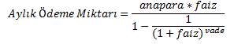

## 6. HAFTA ÇALIŞMA SORULARI

1. 1.Klavyeden girilen kilo değerine kişinin ideal kilosununda – altında yada üzerinde olduğunu bildiren programı yazınız. İdeal kilo hesaplama formülü **İdeal kilo = boy - ((150-boy)/4)+110** şeklinde verilmiştir. Programın kodlarını c# console kodları ile yazınız. 
2. "Bugün günlerden cumartesi ise X gün sonra hangi gün olur?" diye sorulan bir LYS sınav sorusunu klavyeden girilen sayıya göre hesaplayan programı C# Console kodları ile çözünüz .
Örnek: X=100 için Cevap: Pazartesi
3. Üç basamaklı rakamları sıfırdan farklı tüm sayıları ekranda gösteren ve bu kurala uygun kaç tane sayı olduğunu söyleyen programı C# Console kodları ile yazınız.
4. Bir kütüphanede ödünç alınan kitaplar geriye gününden geç getirildiğinde, kitap başına günlük gecikme cezası alınmaktadır. 
Gecikme cezası ilk 5 gün için sabit iken, 6-10 günlerde %10 daha fazla, 11. Günden sonra ise %25 daha fazla uygulanmaktadır. Bu kurala göre; klavyeden geç getirilen kitap sayısı, gecikme gün sayısı ve bir günlük gecikme cezası tutarı girildikten sonra, kişinin ödeyeceği gecikme bedelini hesaplatan ve sonucu ekranda yazdıran programı C# Console kodları ile yazınız.
```less
ÖRNEK: Günlük gecikme miktarı 1TL için 5. gün borcu= 5TL
                                                                                    10. gün borcu=5+5,5=10,5
                                                                                    15.gün borcu=10,5+6,25=16,75
```
5. Bir bankanın kredi hesaplama programını aşağıdaki kurallara göre C# Console kodları ile yazınız.
- Kullanıcı kredi türünü, kredi miktarını ve vade miktarını klavyeden girecektir.
- Kredi türleri konut ve taşıt olarak belirlenecektir. Kullanıcı bunlardan herhangi birini seçebilecektir.
- Her bir kredi türünün farklı faiz oranları olacaktır. Konut kredisi %1,08 ve taşıt kredisi %1,25 olacaktır. 
- Kredi hesaplaması için aşağıdaki formülü kullanın.
-  

**ÖRNEK:**  
```less
Çekilecek Miktar=100000 
Vade:96 
Kredi Türü: Konut Kredisi
Aylık Ödeme Miktarı=1678,48888 
Toplam Ödenecek Miktar=161134,93063 
```
6. Kendisi dışındaki bütün pozitif bölenleri (çarpanları) toplamı sayının kendisine eşit olan sayılara, mükemmel sayılar denir.

Bunlardan en bilineni 6 dır.
Bakalım 6 mükemmel bir sayımı. 6 yı tam bölen sayılar 1, 2 ve 3 tür. Bölenlerin toplamı1+2+3=6 görüldüğü üzere 6 Mükemmel sayı kuralına uyuyor.28 de bir mükemmel sayıdır.28 in tüm bölenleri 1,2,4,7,14 tür toplamları 1+2+4+7+14=28 dir.
Görüldüğü üzere 28 de bir mükemmel sayıdır.
7. Üç basamaklı, rakamları birbirinden farklı rastgele bir sayı üretip bu sayıyı ve sayının basamakları çarpımını ekranda gösteren programı C# console kodları ile yazınız. 
Örnek çıktı: SAYI = 254 - Basamakları çarpımı = 40

8. Klavyeden gireceğiniz pozitif 4 basamaklı bir sayıyı tersten yazan C programını yazınız. 
```less
Örnek çıktı:Bir sayı girin: 1905
Sayının tersten yazılışı: 5091
```
9. Arkadaşlar arasında toplanmış bir grup tokalaşmaktadır. 4 kişi selamlaşırken 
- a. Birey 3 kişi ile 
- b. Birey 2 kişi ile 
- c. Birey 1 kişi ile tokalaşırsa herkes birbiri ile tokalaşmış oluyor
- d. Bireyin hiç kimseyle tokalaşmasına gerek kalmıyor.
10. Üniversitemiz güvenlik görevlilerinden Ahmet,  Mehmet ve Aydın Beyler sırayla her gün nöbet tutmaktadırlar. 1. gün nöbetini pazartesi tutan Ahmet Bey bir sonraki nöbetini Perşembe günü tutmaktadır.
Ahmet Bey ilk nöbetini Salı günü tuttu ise Ahmet beyin X. (klavyeden girdiğimiz X değeri)  nöbet günün hangi güne denk geldiğini bulan programı C# console programı ile yazınız.